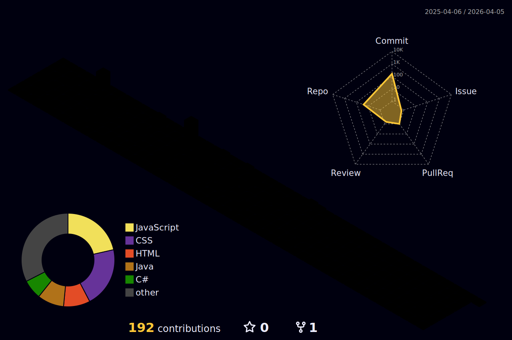

<h1 align="center">Abel Braga WarWar da Fonseca 👋</h1>

<p align="center">
  <b>Full-Stack Developer</b><br>
    
      <br>
  <br>
  💻 Transformando ideias em código funcional e eficiente
</p>

---

### 🚀 Sobre mim

Olá! Sou Abel, desenvolvedor focado no **Back-End**, apaixonado por construir soluções que tornam sistemas mais inteligentes, seguros e escaláveis.

🎯 Busco constantemente aprender novas tecnologias e aprimorar meu código para entregar o melhor resultado possível.

📍 Atualmente em Blumenau - SC  
🔗 Pronome: He/Him

---

### 🛠️ Tecnologias e Ferramentas

```plaintext
Back-End     | Java, Spring Boot, Node.js, C#
Front-End    | HTML, CSS, JavaScript
Banco de Dados | MySQL, PostgreSQL
Testes       | Postman, JUnit
Outros       | Git, GitHub, AWS (Cloud), MVC, Insomnia
📈 Estatísticas GitHub
<p align="center">  </p>
📌 Repositórios em destaque
🔧 ecommerce_backend_Abel – API REST em Java para e-commerce

📝 trabalhofinalSegundoSemestre – Projeto com foco em lógica com JavaScript puro

📫 Contato
📧 abelwarwarfonseca@gmail.com

💼 LinkedIn

🌐 Portfólio (em breve...)

🏆 Conquistas e Próximos Passos
✅ Contribuições em projetos com foco educacional e pessoal
🎯 Aprendizado contínuo em cloud, arquitetura de software e boas práticas
🚀 Em busca de oportunidades profissionais e novos desafios
```
<div align="center">
 
</div>

 

<p align="center"> 💬 Obrigado por visitar meu perfil! Vamos construir juntos soluções que fazem a diferença! </p> 
